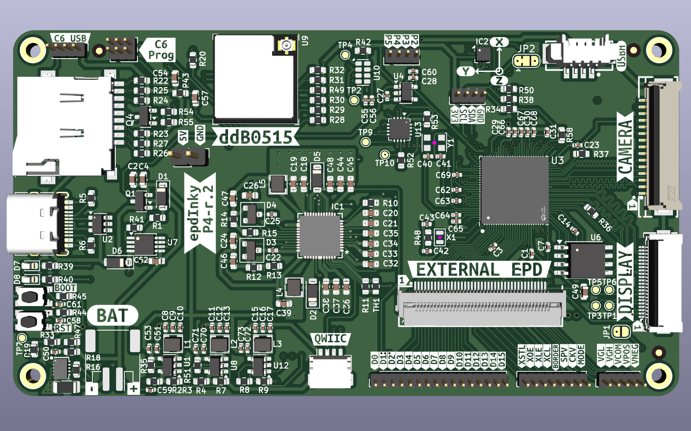

# epdInky

ESP32-P4 board for driving RAW E-Ink display panels

epdInky is powered by ESP32-P4 and companion ESP32-C6 for WiFi

Other peripherals:

- TPS651851RSLR - PMIC for e-Ink (I2C addr: 0x68)

- KXTJ3-1057 - 3-axis accelerometar  (I2C addr: 0x0F)

- RV-3028-C7 - RTC (I2C addr: 0x52)

- STC3115AIQT - Fuel guage (I2C addr: 0x70)

- TCA6408ARGTR - GPIO Extender (I2C addr: 0x21)

- TP4056 Battery charger (500mA)

Software side:

E-Ink handling is done by [FastEPD](https://github.com/bitbank2/FastEPD/) library and support 8bit mode and 16bit mode

List of panels tested and working (keep in mind column 1bit/4bit support)

| Panel | Resulution | 8/16bit | Gray levels | Pin count | Tested |
| ----- | ---------- | ------- | ----------- | --------- | ------ |
|       |            |         |             |           |        |
|       |            |         |             |           |        |
|       |            |         |             |           |        |
|       |            |         |             |           |        |
|       |            |         |             |           |        |

