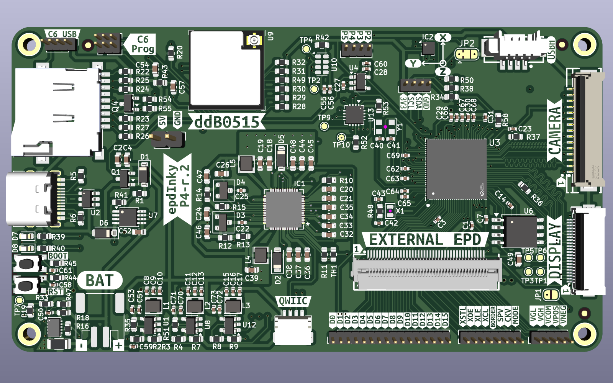

# epdInky

ESP32-P4 board for driving RAW E-Ink display panels, epdInky is powered by ESP32-P4 and companion ESP32-C6 for WiFi

If you wanna get one for yourself hop to shop: https://shop.fasani.de/en_US/products/epdinky

# Hardware Specifications

## SoC
- **Model:** Espressif Systems ESP32-P4NRW32

## CPU
- Dual-core 32-bit RISC-V High-Performance (HP) CPU
  - Up to **400 MHz**
  - AI instruction extension
  - Single-precision FPU
- Single-core RISC-V Low-Power (LP) MCU
  - Up to **40 MHz**

## Memory
- 768 KB HP L2MEM (shared by dual-core CPU)
- 32 KB LP SRAM
- 8 KB TCM (for LP MCU core)
- 32 MB PSRAM

## Storage
- **Internal ROM**
  - 128 KB HP ROM
  - 16 KB LP ROM
- **Flash**
  - 32 MB QSPI NOR Flash
- **Expandable**
  - MicroSD card slot

## Graphics & Video
- **GPU:** 2D Pixel Processing Accelerator (PPA)
- **VPU:** H.264 and JPEG codec support

## Camera
- MIPI CSI camera sensor interface

## Wireless
- **Companion chip:** ESP32-C6
- 2.4 GHz Wi-Fi 6
- Bluetooth 5.x Low Energy (LE)
- IEEE 802.15.4 radio
  - Zigbee
  - Thread
  - Matter

## USB
- USB Type-C port
  - Power
  - Debugging

## Sensors
- 6-axis KXTJ3-1057 motion sensor
  - Portrait/landscape orientation detection

## Miscellaneous
- Reset button
- Boot button
- Power LED
- Battery LED
- RV-3028-C7 RTC with timed interrupt wake-up support

## Power Supply
- 5V via USB Type-C
- JST battery connector

## Dimensions
- **100 × 55 mm**

## I2C peripherals:

- TPS651851RSLR - PMIC for e-Ink (I2C addr: 0x68)
- KXTJ3-1057 - 3-axis accelerometar  (I2C addr: 0x0F)
- RV-3028-C7 - RTC (I2C addr: 0x52)
- STC3115AIQT - Fuel guage (I2C addr: 0x70)
- TCA6408ARGTR - GPIO Extender (I2C addr: 0x21)
- TP4056 Battery charger (500mA)

Software side:

E-Ink handling is done by [FastEPD](https://github.com/bitbank2/FastEPD/) library and support 8bit mode and 16bit mode

List of panels tested and working (keep in mind 2/4bit support for panels is still WIP and will be some time to do it)

| Panel | Resulution | 8/16bit | Gray levels | Pin count | Tested |
| ----- | ---------- | ------- | ----------- | --------- | ------ |
| ED070KH1 | 1680x1264 | 16 bit | 1/2/4 | 40 pin |    1 bit only    |
| ED097TC2 | 1200x825 | 8 bit | 1/2/4 | 33 pin | 1 bit only |
| ES133TT3 | 2200x1650 | 16 bit | 1/2/4 | 39 pin | 1 bit only |
| ED115OC1 | 2760x2070 | 16 bit | 1/2/4 | 40 pin | 1 bit only |
| ED113TC1| 2400x1034 | 16 bit | 1/2/4 | 50 pin | 1 bit only |
| ED052TC4 | 1280x720 | 8 bit | 1/2/4 | 50 pin | 1 bit only |
| ED060SCN | 800x600 | 8 bit| 1/2/4 | 34 pin | 1 bit only |
| ED060SCP | 800x600 | 8 bit| 1/2/4 | 34 pin | 1 bit only |
| ED060SC7 | 800x600 | 8 bit| 1/2/4 | 34 pin | 1 bit only |
| ET017QG1 |320x240| 8 bit | 1/2/4 | 39 pin| 1 bit only |
|       |            |         |             |           |        |
|       |            |         |             |           |        |

